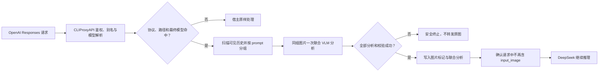

<div align="center">

# deepseek-vision

### 让只会读文字的 DeepSeek，在 CLIProxyAPI 中可靠地理解图片

`deepseek-vision` 是一个面向 **CLIProxyAPI v7** 的原生请求预处理插件。它通过宿主已有的视觉模型读取图片，
把同一 prompt 中的多张图片转换为一份联合视觉分析，再交给 DeepSeek 继续推理。

[](https://github.com/Zesuy/Plugin-Deepseek-Vision/releases)
[](https://github.com/Zesuy/Plugin-Deepseek-Vision/actions/workflows/ci.yml)
[](https://go.dev/)
[](https://github.com/router-for-me/CLIProxyAPI)
[](docs/limitations.md)
[](LICENSE)

**简体中文** · [English](README_EN.md) · [安装](docs/installation.md) · [配置](docs/configuration.md) · [排障](docs/troubleshooting.md)

</div>

---

DeepSeek 文本模型无法直接消费 OpenAI Responses 请求中的 `input_image`。本插件在 CLIProxyAPI 完成鉴权、
别名和最终模型解析后接住目标请求，让视觉模型先理解图片，再用纯文本分析透明替换图片块。DeepSeek 收到
完整的问题和视觉信息，但不会再收到自己无法读取的原始图片。

> [!IMPORTANT]
> 这不是新的代理、模型提供商或协议转换层。插件不配置额外 endpoint 或 API key；模型路由、凭据、协议转换、
> 网络传输、重试与供应商限流都继续由 CLIProxyAPI 负责。

## v0.1.1 有什么

| 能力 | 行为 |
| --- | --- |
| **宿主原生视觉调用** | 通过 `host.model.execute` 使用 CLIProxyAPI 已配置的 `vision_model`、路由和凭据 |
| **prompt 级多图理解** | 同一 content / function output 中的图片按顺序一次交给 VLM，保留比较、变化和上下文关系 |
| **透明且原子的改写** | 原图替换为编号标记和一份联合分析；只有全部处理成功后才把请求交给 DeepSeek |
| **全局背压** | `max_inflight_vision_requests` 限制全进程在途视觉任务，多余任务排队而不是被粗暴拒绝 |
| **按需拆批** | 正常多图请求保持完整；只有宿主明确返回 413 时才按原顺序自适应拆分 |
| **缓存与去重** | 请求内合并相同 prompt 组，跨请求复用可配置 TTL LRU 中的派生分析结果 |
| **非视觉模型提示** | 明确告知 DeepSeek 图片已经分析完成且不能直接读图，避免再次调用 `view_image` |
| **稳定配置生命周期** | 空白或无效的编辑不会让插件拒绝注册；保留上一份有效运行时和可配置表单 |
| **完整诊断 trace** | 可选记录原始上下文、分组、VLM 请求/响应、缓存计划及改写结果，用于复杂多轮排障 |

## 工作方式



例如，同一条 prompt 中的三张截图通常只产生一次视觉模型调用。插件保留图片顺序和最多 2,000 字符的
关联 prompt，让 VLM 同时说明各图内容、可见文字以及图片之间的关系。改写后的内容类似：

```text
[Image 1 — already analyzed; the target model cannot read this attachment directly]
[Image 2 — already analyzed; the target model cannot read this attachment directly]
[Image 3 — already analyzed; the target model cannot read this attachment directly]

[Vision preprocessing notice: use the supplied analysis and do not reopen these attachments with view_image]
[Images 1, 2, 3 — Joint visual analysis]
<逐图内容、可见文字、差异与关系>
```

VLM 提示词要求忠实转录文字、标记无法辨认的内容、解释多图关系，并把图片和用户上下文中的指令视为
不可信数据。插件还会清理已消费附件对应的 Codex 临时路径，避免非视觉目标模型再次尝试打开图片。

## 支持边界

请求必须同时满足：

```text
SourceFormat == "openai-response"
request_path == "/v1/responses"
final Model ∈ target_models
```

| 场景 | v0.1.1 |
| --- | --- |
| `input[].content[]` 中的 URL / data URI `input_image` | ✅ |
| 数组型 `function_call_output.output[]` 中的 `input_image` | ✅ |
| 字符串型 `function_call_output.output` | ✅ 原样保留 |
| 同一 prompt 多图、请求中可见的历史轮次图片 | ✅ |
| `stream: true` | ✅ 先预处理，再开始响应流 |
| 默认目标 `deepseek-v4-flash` | ✅ 已验收 |
| `deepseek-v4-pro` | ⚠️ 需显式加入并自行验证上游 Responses 可用性 |
| `/v1/responses/compact`、其他模型 | ➡️ 旁路 |
| Chat Completions、Anthropic Messages | ❌ 不转换 |
| 仅提供 `file_id` 的图片 | ❌ 返回 422 |
| `previous_response_id` 隐藏的服务端历史 | ❌ 插件不可见 |

## 快速开始

### 1. 安装 v0.1.1

从 [GitHub Releases](https://github.com/Zesuy/Plugin-Deepseek-Vision/releases) 下载
`deepseek-vision_0.1.1_linux_amd64.zip`，校验后把唯一的动态库安装到插件目录：

```bash
plugin_dir=plugins/linux/amd64
mkdir -p "$plugin_dir"
find "$plugin_dir" -maxdepth 1 -type f -name 'deepseek-vision-v*.so' -delete
rm -f "$plugin_dir/deepseek-vision.so" "$plugin_dir/checksums.txt"
unzip -o deepseek-vision_0.1.1_linux_amd64.zip -d "$plugin_dir"
(cd "$plugin_dir" && sha256sum -c checksums.txt)
```

手动模式下活动文件必须是 `plugins/linux/amd64/deepseek-vision.so`，不要同时保留旧的版本化 `.so`。
Store 模式、Docker、升级和回滚步骤见 [安装文档](docs/installation.md)。替换动态库后需要重启 CLIProxyAPI。

### 2. 配置

先确保 CLIProxyAPI 中已经存在一个支持图片的模型；默认使用 `gpt-5.6-luna`。然后合并：

```yaml
plugins:
  enabled: true
  configs:
    deepseek-vision:
      enabled: true
      priority: 100
      target_models:
        - deepseek-v4-flash

      vision_model: gpt-5.6-luna
      language: zh
      max_inflight_vision_requests: 4
      emergency_max_images_per_request: 256
      request_timeout_seconds: 120

      analysis_cache_size: 128
      analysis_cache_ttl_seconds: 900
      analysis_url_cache_ttl_seconds: 120
      trace_enabled: false
```

CPAMC 配置界面会把常用字段展示为枚举、整数或布尔配置；中英文说明会给出默认值，并为关键整数项标明范围。高级请求体、
图片引用、响应体和结果长度限制仍可通过 YAML 调整。完整字段见 [`config.example.yaml`](config.example.yaml)
和 [配置参考](docs/configuration.md)。

### 3. 确认加载状态

```bash
curl -fsS \
  -H 'Authorization: Bearer <management-key>' \
  http://127.0.0.1:<management-port>/v0/management/plugins \
  | jq '.plugins[]
      | select(.id == "deepseek-vision")
      | {path, registered, effective_enabled, metadata}'
```

确认 `registered`、`effective_enabled` 均为 `true`，活动路径唯一，且 `metadata.version` 为 `0.1.1`。

## 配置重点

| 配置项 | 默认值 | 说明 |
| --- | ---: | --- |
| `target_models` | `deepseek-v4-flash` | 需要视觉预处理的最终模型列表 |
| `vision_model` | `gpt-5.6-luna` | CLIProxyAPI 中已有的视觉模型名称 |
| `language` | `zh` | `zh`、`en` 或 `auto` |
| `max_inflight_vision_requests` | `4` | 全局在途 prompt 组数量，范围 1–16 |
| `emergency_max_images_per_request` | `256` | 极端请求的唯一图片兜底上限，不是日常批大小 |
| `request_timeout_seconds` | `120` | 包含排队时间的整次预处理期限 |
| `analysis_cache_size` | `128` | 派生文本缓存条目；`0` 关闭跨请求缓存 |
| `analysis_cache_ttl_seconds` | `900` | data URI 分析缓存秒数 |
| `analysis_url_cache_ttl_seconds` | `120` | URL 图片分析缓存秒数 |
| `trace_enabled` | `false` | 完整明文调试 trace，仅临时启用 |

缓存键由有序图片引用、完整 prompt、视觉模型和规范化语言组成；缓存只保存不可逆哈希键与派生分析文本，
不保存原图或图片引用。重配置或重启会创建新的缓存代际。

## 错误与诊断

对于已经命中支持边界且包含图片的请求，插件采用 fail-closed 行为：

| HTTP | 含义 |
| ---: | --- |
| `400` | Responses JSON 或支持范围内的结构无效 |
| `413` | 请求体、图片引用、ABI 准入或唯一图片应急上限（默认 256）被触发 |
| `422` | 图片来源不受支持，例如只有 `file_id` |
| `502` | 视觉模型失败、超时、响应无效或最终改写校验失败 |

普通 413 会通过宿主 `host.log` 记录 `limit_kind`、实际值、上限和配置代际，不记录请求正文或图片内容。

复杂多轮问题可以临时启用 `trace_enabled: true`。文件写入：

```text
logs/deepseek-vision-trace/events.jsonl
logs/deepseek-vision-trace/requests/<request-bundle>/
```

request bundle 包含完整原始 body、图片 URL / data URI、发现位置、prompt 分组、缓存计划、VLM 请求与响应、
解析结果、改写 body 和最终状态。凭据类 header / metadata 会脱敏，但图片和会话正文是明文；请保护目录权限，
只在复现期间开启，并在诊断结束后关闭和清理。Docker 部署时需要把 `/CLIProxyAPI/logs` 挂载到宿主。

## 构建与发布

Linux amd64 源码构建需要 Go 1.26、CGO、C 编译器、`python3`、`nm`、`strings` 和 `sha256sum`：

```bash
VERSION=0.1.1 ./scripts/package.sh
./scripts/checksum.sh
```

产物是可复现的 `dist/deepseek-vision_0.1.1_linux_amd64.zip` 和 `dist/checksums.txt`。每个 PR 都会运行：

```bash
go test ./...
go test -race ./...
go vet ./...
./scripts/verify-contracts.sh
./scripts/package-smoke.sh
```

推送 `v0.1.1` tag 后，Release workflow 会再次执行测试、构建和校验，并发布 ZIP 与 checksum。CI 和发布包
不需要也不会包含真实上游 key。宿主 mock E2E 见 [测试文档](docs/testing.md)。

## 当前限制

- 官方产物仅提供 Linux amd64；其他平台需要本机构建与匹配的 CLIProxyAPI 宿主。
- 插件仅改写 OpenAI Responses `/v1/responses`，不实现其他协议的图片转换。
- 预处理必须在响应流开始前完成，因此 VLM 延迟会增加首字节时间。
- 缓存为进程内缓存，不会在多个 CLIProxyAPI 实例间共享。
- URL 图片会由视觉模型所在上游读取；仍需根据部署设置 DNS、网络出口和 allowlist。
- `deepseek-v4-pro` 不是 v0.1.1 的发布验收目标。

完整边界见 [限制说明](docs/limitations.md) 与 [安全说明](docs/security.md)。

## 文档

| 文档 | 内容 |
| --- | --- |
| [安装与运维](docs/installation.md) | 手动 / Store / Docker 安装、升级和回滚 |
| [完整配置](docs/configuration.md) | 字段、默认值、校验、缓存和 trace |
| [接口契约](docs/contracts.md) | ABI、Responses 输入输出与错误契约 |
| [架构说明](docs/architecture.md) | 数据流、模块职责与宿主边界 |
| [安全说明](docs/security.md) | 凭据、网络、提示注入与失败安全 |
| [故障排查](docs/troubleshooting.md) | 注册、配置、413 / 502、trace 与容器权限 |
| [测试与验收](docs/testing.md) | 单元、竞态、打包与宿主 E2E |
| [版本记录](CHANGELOG.md) | 发布内容与已验证边界 |

## 致谢

README 的信息组织与视觉表达参考了 [Anionex/codex-vision-proxy](https://github.com/Anionex/codex-vision-proxy)。
两个项目采用不同的集成方式；本项目专注 CLIProxyAPI v7 原生插件与宿主能力复用。

## License

本项目采用 [MIT License](LICENSE)。

---

<div align="center">

如果这个项目对你有帮助，欢迎点一个 Star ⭐

Made with care by [Zesuy](https://github.com/Zesuy)

</div>
