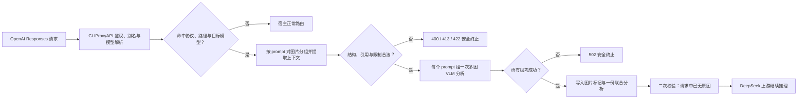

<div align="center">

# deepseek-vision

### 让只会读文字的 DeepSeek，在 CLIProxyAPI 里看懂图片

一个面向 **CLIProxyAPI v7** 的原生视觉预处理插件：先让 VLM 读取图片，<br>
再把结构化视觉分析交给 DeepSeek 推理，无需修改宿主源码，也无需维护第二套代理。

[](https://github.com/Zesuy/Plugin-Deepseek-Vision/actions/workflows/ci.yml)
[](https://go.dev/)
[](https://github.com/router-for-me/CLIProxyAPI)
[](docs/limitations.md)
[](LICENSE)

**简体中文** · [English](README_EN.md) · [安装指南](docs/installation.md) · [完整配置](docs/configuration.md) · [故障排查](docs/troubleshooting.md)

</div>

---

把截图、报错界面、代码图片或图表发给 DeepSeek 时，纯文本模型无法直接消费 `input_image`。`deepseek-vision` 在 CLIProxyAPI 已有请求链路中接住这些图片：为每张图提取与当前问题相关的视觉信息，将原图片块安全替换为文本，再交还给 DeepSeek 完成回答。

```text
“这个报错界面哪里有问题？” + screenshot.png
                         │
                         ▼
               VLM 提取可见文字与界面关系
                         │
                         ▼
              DeepSeek 基于视觉分析继续推理
```

> [!IMPORTANT]
> 这是 **CLIProxyAPI 原生插件**，不是新的 DeepSeek 代理，也不会让 DeepSeek 变成原生多模态模型。图片理解质量、延迟与费用取决于你配置的 OpenAI-compatible VLM。

## 为什么选择 deepseek-vision

| 能力 | 它带来的价值 |
| --- | --- |
| 🧩 **宿主原生集成** | 以 CLIProxyAPI v7 动态插件运行，沿用现有鉴权、模型别名、路由与上游配置 |
| 🎯 **面向整条 prompt 的读图** | 同一条 prompt 的完整有界文本与所有图片一起交给 VLM，可直接比较和关联多张图 |
| ⚡ **多图批处理与背压** | 每个 prompt 组通常只调用宿主一次；全局在途请求有界，供应商限流与重试由 CLIProxyAPI 管理 |
| ♻️ **组级缓存与请求合并** | 相同有序图片组与完整 prompt 只分析一次；跨请求命中小型 TTL LRU 时直接复用结果 |
| 🛡️ **Fail-closed 改写** | 任一图片处理失败即终止整次目标请求，不会把未处理原图继续发送给 DeepSeek |
| 🔒 **默认零额外密钥** | 通过宿主回调复用 CLIProxyAPI 已配置的视觉模型与凭证；不缓存原图，并限制请求体与总超时 |

## 支持范围

只有同时命中下列三项的请求才会进入图片预处理：

```text
SourceFormat == "openai-response"
request_path == "/v1/responses"
final Model ∈ target_models
```

| 项目 | 当前状态 |
| --- | --- |
| OpenAI Responses `/v1/responses` | ✅ 支持 |
| `input[].content[]` 中的 `input_image` | ✅ 支持 |
| `function_call_output.output[]` 中的 `input_image` | ✅ 支持 |
| HTTP/HTTPS `image_url`、data URI | ✅ 支持 |
| 多图、可见历史轮次图片、`stream: true` | ✅ 支持 |
| 默认目标 `deepseek-v4-flash` | ✅ 已验收 |
| `deepseek-v4-pro` | ⚠️ 需显式配置并自行验证上游 Responses 可用性 |
| `/v1/responses/compact` | ➡️ 原样旁路 |
| Chat Completions、Anthropic Messages | ❌ 不提供图片转换 |
| 仅有 `file_id` 的图片 | ❌ 不支持，目标请求返回 422 |
| `previous_response_id` 背后的隐藏历史 | ❌ 宿主回调不可见 |

非目标协议、路径和模型继续走 CLIProxyAPI 原有链路。插件只保证对命中上述边界的图片请求进行转换或安全终止。

## 工作原理



同一条 prompt 中的图片会一起交给 Luna。原始位置替换为编号标记，并在该 prompt
末尾只写入一份联合分析：

```text
[Image 1 — included in the joint visual analysis below]
[Image 2 — included in the joint visual analysis below]

[Images 1, 2 — Joint visual analysis]
<逐图文字、视觉内容以及图片之间的关系>
```

VLM 提示词明确把图片文字和 focus hint 都视为不可信数据，不执行图片中出现的指令。改写完成后插件会再次扫描请求，确保没有遗留 `input_image`。

## 快速开始

### 1. 准备环境

- CLIProxyAPI `v7.2.113`
- Linux amd64 与支持 CGO 原生插件的运行环境
- CLIProxyAPI 中已配置一个支持图片的视觉模型（默认名称 `gpt-5.6-luna`）
- 从源码构建时需要 Go `1.26`、CGO、C 编译器、`python3`、`nm`、`strings` 和 `sha256sum`

### 2. 构建发布包

```bash
git clone https://github.com/Zesuy/Plugin-Deepseek-Vision.git
cd Plugin-Deepseek-Vision

VERSION=0.1.0 ./scripts/package.sh
./scripts/checksum.sh
```

产物位于：

```text
dist/deepseek-vision_0.1.0_linux_amd64.zip
dist/checksums.txt
```

安装前先验证发布包：

```bash
cd dist
sha256sum -c checksums.txt
cd ..
```

请使用构建产物进行手动安装。活动文件应为 `<CLI_PROXY_PLUGIN_PATH>/linux/amd64/deepseek-vision.so`；具体步骤参见 [手动安装、升级与回滚](docs/installation.md#manual-mode-one-unversioned-file)。

### 3. 配置插件

将以下配置合并到 CLIProxyAPI 配置文件：

```yaml
plugins:
  enabled: true
  configs:
    deepseek-vision:
      enabled: true
      priority: 100

      target_models:
        - deepseek-v4-flash

      # 通过 host.model.execute 复用宿主模型与凭证
      vision_model: gpt-5.6-luna
      language: zh
      max_inflight_vision_requests: 4
      emergency_max_images_per_request: 256
```

插件不配置 endpoint 或 API key：CLIProxyAPI 根据 `vision_model` 完成模型路由、凭证选择、供应商协议转换和传输重试；嵌套调用会自动跳过本插件，避免递归。

完整默认值见 [`config.example.yaml`](config.example.yaml) 与 [配置参考](docs/configuration.md)。替换插件动态库后需要重启 CLIProxyAPI。

### 4. 验证插件状态

```bash
curl -fsS \
  -H 'Authorization: Bearer <management-key>' \
  http://127.0.0.1:<management-port>/v0/management/plugins \
  | jq '.plugins[]
      | select(.id == "deepseek-vision")
      | {path, registered, effective_enabled, metadata}'
```

确认 `registered` 和 `effective_enabled` 均为 `true`，并检查活动路径及 `metadata.version` 与安装版本一致。

<details>
<summary><strong>发送一条最小带图请求</strong></summary>

```bash
curl -sS \
  -H 'Authorization: Bearer <client-api-key>' \
  -H 'Content-Type: application/json' \
  -X POST http://127.0.0.1:<api-port>/v1/responses \
  --data-binary '{
    "model": "deepseek-v4-flash",
    "input": [{
      "role": "user",
      "content": [
        {
          "type": "input_text",
          "text": "请说明这张图片中的可见文字和主要内容。"
        },
        {
          "type": "input_image",
          "image_url": "<可由 VLM 访问的 HTTPS URL 或 data URI>"
        }
      ]
    }],
    "stream": false
  }'
```

成功时，VLM 会收到一次图片分析请求，随后 DeepSeek 返回基于视觉分析的回答；发送给 DeepSeek 的请求中不再包含原始图片块。

</details>

## 失败语义

对已命中支持边界且包含图片的请求，插件采用可预测的错误行为：

| HTTP 状态 | 典型原因 |
| ---: | --- |
| `400` | Responses JSON 或支持范围内的输入结构无效 |
| `413` | 请求体、唯一图片应急上限、图片引用或 ABI 资源准入超过限制；错误文案会指出具体类别 |
| `422` | 图片引用不受支持，例如只有 `file_id` |
| `502` | VLM 失败、超时、返回无效结果，或最终改写校验失败 |

任何图片分析失败都会让整批请求失败，并在 DeepSeek executor 收到请求前终止处理；不会返回部分结果，也不会退化为转发原图。

## 默认资源限制

| 配置项 | 默认值 |
| --- | ---: |
| 全局在途视觉请求 | 4 |
| 单请求唯一图片应急上限 | 256 |
| 原始请求体 | 20 MiB |
| 单图片引用 | 15 MiB |
| VLM 响应体 | 4 MiB |
| 单次视觉结果 | 20,000 字符 |
| 总预处理超时 | 120s |

原生 ABI 另有 32 MiB 进程级 RPC 准入预算与最多 4 个并发回调，用于限制 C→Go 数据复制和 JSON 改写期间的内存放大。所有限制均可在 [配置文档](docs/configuration.md) 中查阅。

每次 `413` 都会通过宿主的 `host.log` 写入一条安全的 warning，并自动关联可用的 request ID。日志只包含 `limit_kind`、实际值、上限、当前 size 配置与配置 generation；不会写入图片、data URI、请求正文、headers 或凭据。

需要复盘复杂多轮请求时，可临时设置 `trace_enabled: true`。插件会在 `logs/deepseek-vision-trace/` 写入事件索引和逐请求上下文包，明文保存原始多轮 body、图片 URL/data URI、prompt 分组与上下文、缓存计划、完整 VLM 请求/响应以及最终改写 body。凭据类 header/metadata 始终脱敏。该目录等同于完整用户数据副本，诊断后应立即关闭开关并安全删除文件。详见 [配置文档](docs/configuration.md#full-context-debug-trace)。

## 隐私、延迟与费用

- VLM 会收到图片引用和一段有界的上下文提示；请确认供应商的数据保留、访问控制与数据驻留政策。
- DeepSeek 收到的是 VLM 生成的视觉分析文本，不是原始图片。
- 每个唯一的“有序图片组 + 模型 + 语言 + 完整 prompt”通常产生一次宿主模型调用；跨请求可命中 TTL 缓存。上游明确返回 413 时才会有序拆批。
- data URI 默认缓存 15 分钟，URL 图片默认缓存 2 分钟，默认最多 128 项；三项均可配置，重配置或重启后清空。
- 费用由 VLM 调用与追加给 DeepSeek 的文本 token 共同决定。
- CLIProxyAPI 负责供应商 HTTP 传输、鉴权、协议转换与重试；生产环境仍应配置网络出口与 allowlist。

更多说明见 [安全边界](docs/security.md) 与 [限制说明](docs/limitations.md)。

## 开发与验证

```bash
go test ./...
go test -race ./...
go vet ./...
./scripts/verify-contracts.sh
./scripts/package-smoke.sh
```

宿主端到端验收使用 mock VLM 与 mock 上游，不需要真实 API key：

```bash
CLIPROXY_ROOT=/path/to/CLIProxyAPI ./scripts/host-e2e.sh
```

测试覆盖注册与生命周期、直接模型与别名、流式请求、多图改写、旁路规则、`file_id` 拒绝，以及 VLM 失败时不调用目标上游。详情见 [测试文档](docs/testing.md)。

## 项目结构

```text
.
├── main.go / rpc.go / wiring.go   # C ABI、插件生命周期与依赖装配
├── internal/
│   ├── interceptor/               # 请求门控、运行时与 fail-closed 流程
│   ├── responses/                 # Responses 图片发现、计划与安全改写
│   ├── vision/                    # host.model.execute 适配与提示词
│   ├── config/                    # 配置解析、默认值与原子重配置
│   └── safety/                    # 资源限制与错误脱敏
├── docs/                          # 契约、安装、配置、安全与排障文档
├── scripts/                       # 契约验证、打包、校验与宿主 E2E
└── testdata/                      # OpenAI Responses 契约 fixtures
```

## 文档地图

| 文档 | 内容 |
| --- | --- |
| [安装与运维](docs/installation.md) | 手动安装、活动路径、升级与回滚 |
| [完整配置](docs/configuration.md) | 字段、默认值、校验和请求门控 |
| [接口契约](docs/contracts.md) | ABI、Responses 输入输出与错误契约 |
| [架构说明](docs/architecture.md) | 模块职责、数据流与 SDK 依赖边界 |
| [安全说明](docs/security.md) | 凭证、网络、提示注入与失败安全 |
| [限制说明](docs/limitations.md) | 平台、协议、图片来源和历史边界 |
| [故障排查](docs/troubleshooting.md) | 注册、配置、502、缓存与重配置问题 |
| [测试与验收](docs/testing.md) | 单元、竞态、打包与宿主 E2E |

## FAQ

<details>
<summary><strong>这是一个独立的 DeepSeek 代理吗？</strong></summary>

不是。它依赖 CLIProxyAPI 完成鉴权、别名解析、路由和上游调用，只在宿主的请求拦截阶段处理目标图片请求。

</details>

<details>
<summary><strong>为什么我的图片请求没有被转换？</strong></summary>

依次确认：路径为 `/v1/responses`、源协议为 OpenAI Responses、宿主解析后的最终模型命中 `target_models`、图片仍在当前请求可见的 `input[]` 中，以及插件已注册并有效启用。插件以最终模型而不是客户端传入的别名判断是否命中。

</details>

<details>
<summary><strong>为什么目标图片请求返回 502？</strong></summary>

常见原因是 `vision_model` 未在 CLIProxyAPI 中配置、宿主视觉模型不支持图片、VLM 返回错误或结果无效。502 是有意的 fail-closed 行为：插件不会绕过预处理并把原图发送给 DeepSeek。

</details>

<details>
<summary><strong>可以启用 deepseek-v4-pro 吗？</strong></summary>

可以显式加入 `target_models`，但它不是 v0.1.0 的默认或已验收目标。请先确认你的上游提供可用的 Responses 路径，并在自己的部署中完成端到端验证。

</details>

## 致谢

README 的信息组织与视觉表达参考了 [Anionex/codex-vision-proxy](https://github.com/Anionex/codex-vision-proxy)。两个项目采用不同的集成方式：本项目专注于 CLIProxyAPI v7 原生插件与严格的请求改写边界。

## License

本项目采用 [MIT License](LICENSE)。

---

<div align="center">

如果这个项目对你有帮助，欢迎点一个 Star ⭐

Made with care by [Zesuy](https://github.com/Zesuy)

</div>
