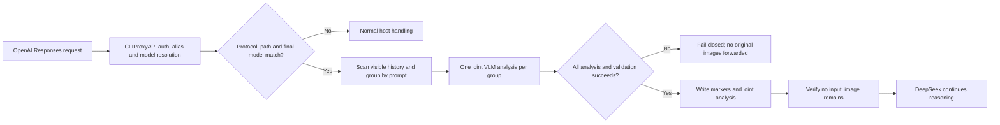

<div align="center">

# deepseek-vision

### Reliable image understanding for text-only DeepSeek models in CLIProxyAPI

`deepseek-vision` is a native **CLIProxyAPI v7** request-preprocessing plugin. It uses a vision model already available
through the host, turns all images in one prompt into a joint visual analysis, and lets DeepSeek continue with text.

[](https://github.com/Zesuy/Plugin-Deepseek-Vision/releases)
[](https://github.com/Zesuy/Plugin-Deepseek-Vision/actions/workflows/ci.yml)
[](https://go.dev/)
[](https://github.com/router-for-me/CLIProxyAPI)
[](docs/limitations.md)
[](LICENSE)

[简体中文](README.md) · **English** · [Installation](docs/installation.md) · [Configuration](docs/configuration.md) · [Troubleshooting](docs/troubleshooting.md)

</div>

---

Text-only DeepSeek models cannot consume `input_image` blocks from OpenAI Responses requests. After CLIProxyAPI has
completed authentication, alias resolution, and final-model selection, this plugin asks a vision model to understand
the images and transparently replaces them with plain-text analysis. DeepSeek receives the original task plus the
visual information, but never receives image blocks it cannot read.

> [!IMPORTANT]
> This is not another proxy, model provider, or protocol-conversion layer. The plugin has no extra endpoint or API-key
> setting. CLIProxyAPI continues to own model routing, credentials, protocol translation, transport, retries, and
> provider rate-limit policy.

## What v0.1.1 provides

| Capability | Behavior |
| --- | --- |
| **Native host execution** | Calls `host.model.execute` with the configured `vision_model`, reusing host routing and credentials |
| **Prompt-level multi-image analysis** | Sends ordered images from one content/function-output item in one VLM call, preserving comparisons and progression |
| **Atomic transparent rewrite** | Replaces images with numbered markers and one joint analysis only after every group succeeds |
| **Global backpressure** | `max_inflight_vision_requests` bounds process-wide work; excess groups queue instead of being rejected |
| **Adaptive splitting** | Keeps normal multi-image prompts intact and splits in order only after an explicit host 413 |
| **Cache and deduplication** | Coalesces identical work in one request and reuses derived analysis from a configurable TTL LRU |
| **Non-vision model notice** | Tells DeepSeek that attachments are already analyzed and must not be reopened with `view_image` |
| **Stable configuration lifecycle** | Empty or invalid edits do not unregister the plugin; the last valid runtime and form remain available |
| **Full diagnostic trace** | Optionally captures context, grouping, VLM calls, cache decisions, and rewritten requests for debugging |

## How it works



Three screenshots attached to one prompt normally produce one vision-model call. Their order and up to 2,000
characters of associated prompt text are preserved so the VLM can explain each image, transcribe visible text, and
describe relationships between them. The rewritten item resembles:

```text
[Image 1 — already analyzed; the target model cannot read this attachment directly]
[Image 2 — already analyzed; the target model cannot read this attachment directly]
[Image 3 — already analyzed; the target model cannot read this attachment directly]

[Vision preprocessing notice: use the supplied analysis and do not reopen these attachments with view_image]
[Images 1, 2, 3 — Joint visual analysis]
<per-image content, visible text, differences, and relationships>
```

The VLM prompt asks for faithful transcription, explicit illegible markers, and cross-image relationships. It treats
instructions in images and user context as untrusted data. Matching Codex temporary attachment paths are also removed
so the non-vision target model does not try to open the consumed images again.

## Support boundary

All three conditions must match:

```text
SourceFormat == "openai-response"
request_path == "/v1/responses"
final Model in target_models
```

| Scenario | v0.1.1 |
| --- | --- |
| URL/data-URI `input_image` in `input[].content[]` | ✅ |
| `input_image` in array-form `function_call_output.output[]` | ✅ |
| String-form `function_call_output.output` | ✅ preserved unchanged |
| Multiple images and visible historical turns in the request | ✅ |
| `stream: true` | ✅ preprocessing completes before streaming |
| Default target `deepseek-v4-flash` | ✅ release-tested |
| `deepseek-v4-pro` | ⚠️ opt in and verify upstream Responses availability |
| `/v1/responses/compact` and other models | ➡️ pass through |
| Chat Completions and Anthropic Messages | ❌ no conversion |
| Images represented only by `file_id` | ❌ 422 |
| Server-side history hidden behind `previous_response_id` | ❌ not visible to the plugin |

## Quick start

### 1. Install v0.1.1

Download `deepseek-vision_0.1.1_linux_amd64.zip` from
[GitHub Releases](https://github.com/Zesuy/Plugin-Deepseek-Vision/releases), verify it, and install the only dynamic
library in the manual plugin directory:

```bash
plugin_dir=plugins/linux/amd64
mkdir -p "$plugin_dir"
find "$plugin_dir" -maxdepth 1 -type f -name 'deepseek-vision-v*.so' -delete
rm -f "$plugin_dir/deepseek-vision.so" "$plugin_dir/checksums.txt"
unzip -o deepseek-vision_0.1.1_linux_amd64.zip -d "$plugin_dir"
(cd "$plugin_dir" && sha256sum -c checksums.txt)
```

Manual mode requires `plugins/linux/amd64/deepseek-vision.so` with no stale versioned `.so` beside it. See the
[installation guide](docs/installation.md) for Store mode, Docker, upgrades, and rollback. Restart CLIProxyAPI after
replacing the library.

### 2. Configure

First configure a vision-capable model in CLIProxyAPI. The plugin defaults to `gpt-5.6-luna`:

```yaml
plugins:
  enabled: true
  configs:
    deepseek-vision:
      enabled: true
      priority: 100
      target_models:
        - deepseek-v4-flash

      vision_model: gpt-5.6-luna
      language: en
      max_inflight_vision_requests: 4
      emergency_max_images_per_request: 256
      request_timeout_seconds: 120

      analysis_cache_size: 128
      analysis_cache_ttl_seconds: 900
      analysis_url_cache_ttl_seconds: 120
      trace_enabled: false
```

The CPAMC form exposes common values as enum, integer, and boolean fields. Bilingual descriptions state defaults and
give ranges for key integer controls. Advanced
body, image-reference, response, and output limits remain available in YAML. See
[`config.example.yaml`](config.example.yaml) and the [configuration reference](docs/configuration.md).

### 3. Verify registration

```bash
curl -fsS \
  -H 'Authorization: Bearer <management-key>' \
  http://127.0.0.1:<management-port>/v0/management/plugins \
  | jq '.plugins[]
      | select(.id == "deepseek-vision")
      | {path, registered, effective_enabled, metadata}'
```

`registered` and `effective_enabled` should both be `true`, the active path should be unique, and
`metadata.version` should be `0.1.1`.

## Important configuration

| Field | Default | Purpose |
| --- | ---: | --- |
| `target_models` | `deepseek-v4-flash` | Final models eligible for visual preprocessing |
| `vision_model` | `gpt-5.6-luna` | Vision model already configured in CLIProxyAPI |
| `language` | `zh` | `zh`, `en`, or `auto` |
| `max_inflight_vision_requests` | `4` | Process-wide prompt-group calls, range 1–16 |
| `emergency_max_images_per_request` | `256` | Last-resort unique-image ceiling, not a normal batch size |
| `request_timeout_seconds` | `120` | Total preprocessing deadline including queueing |
| `analysis_cache_size` | `128` | Derived-analysis entries; `0` disables cross-request reuse |
| `analysis_cache_ttl_seconds` | `900` | Data-URI analysis TTL in seconds |
| `analysis_url_cache_ttl_seconds` | `120` | URL-image analysis TTL in seconds |
| `trace_enabled` | `false` | Full plaintext diagnostic trace; enable temporarily |

Cache keys include ordered image references, the complete prompt, vision model, and normalized language. Entries store
only an irreversible hash key and derived text, not source images or references. Reconfigure/restart begins a new cache
generation.

## Errors and diagnostics

Eligible image requests fail closed:

| HTTP | Meaning |
| ---: | --- |
| `400` | Invalid Responses JSON or supported input structure |
| `413` | Request body, image reference, ABI admission, or unique-image emergency ceiling (default 256) exceeded |
| `422` | Unsupported image source such as `file_id` only |
| `502` | Vision-model failure, timeout, invalid response, or final rewrite verification failure |

Ordinary 413 errors emit a host `host.log` warning with the limit kind, actual value, maximum, and configuration
generation, never request or image content.

For difficult multi-turn failures, temporarily set `trace_enabled: true`. It writes:

```text
logs/deepseek-vision-trace/events.jsonl
logs/deepseek-vision-trace/requests/<request-bundle>/
```

Each bundle includes the exact inbound body, image URLs/data URIs, discovery positions, prompt groups, cache plan, VLM
requests/responses, parsed output, rewritten body, and final status. Credential-like headers and metadata are redacted,
but image and conversation data remain plaintext. Protect the directory, disable tracing after reproduction, and remove
the retained files. Docker deployments must mount `/CLIProxyAPI/logs` to the host.

## Build and release

Linux amd64 source builds require Go 1.26, CGO, a C compiler, `python3`, `nm`, `strings`, and `sha256sum`:

```bash
VERSION=0.1.1 ./scripts/package.sh
./scripts/checksum.sh
```

This produces reproducible `dist/deepseek-vision_0.1.1_linux_amd64.zip` and `dist/checksums.txt`. Every PR runs:

```bash
go test ./...
go test -race ./...
go vet ./...
./scripts/verify-contracts.sh
./scripts/package-smoke.sh
```

Pushing tag `v0.1.1` makes the Release workflow repeat validation and publish the ZIP and checksum. CI and release
assets need no real upstream key. See [testing](docs/testing.md) for the mock-host E2E path.

## Current limitations

- Official artifacts currently target Linux amd64; other platforms require a native build and matching host.
- Only OpenAI Responses `/v1/responses` is rewritten; no other source protocol receives image conversion.
- VLM preprocessing completes before streaming, so it adds time to first byte.
- The cache is process-local and is not shared across CLIProxyAPI instances.
- Remote URLs are fetched by the selected vision provider; deployments still need DNS, egress, and allowlist policy.
- `deepseek-v4-pro` is not a v0.1.1 release-acceptance target.

See [limitations](docs/limitations.md) and [security](docs/security.md) for the full boundary.

## Documentation

| Document | Contents |
| --- | --- |
| [Installation](docs/installation.md) | Manual / Store / Docker install, upgrade, and rollback |
| [Configuration](docs/configuration.md) | Fields, defaults, validation, cache, and trace |
| [Contracts](docs/contracts.md) | ABI, Responses input/output, and error contract |
| [Architecture](docs/architecture.md) | Data flow, module ownership, and host boundary |
| [Security](docs/security.md) | Credentials, network, prompt injection, and failure safety |
| [Troubleshooting](docs/troubleshooting.md) | Registration, configuration, 413 / 502, trace, and container permissions |
| [Testing](docs/testing.md) | Unit, race, package, and host E2E validation |
| [Changelog](CHANGELOG.md) | Release contents and validated boundary |

## Acknowledgements

The README organization and visual presentation were inspired by
[Anionex/codex-vision-proxy](https://github.com/Anionex/codex-vision-proxy). The projects use different integration
models; this repository focuses on a CLIProxyAPI v7 native plugin and host capability reuse.

## License

This project is licensed under the [MIT License](LICENSE).

---

<div align="center">

If this project helps you, a Star is always appreciated ⭐

Made with care by [Zesuy](https://github.com/Zesuy)

</div>
